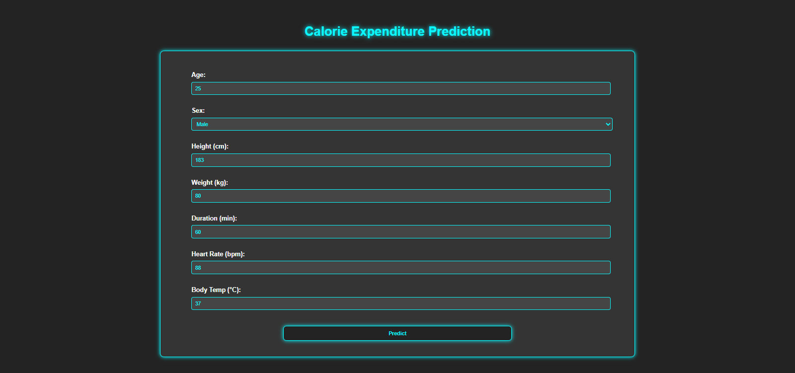
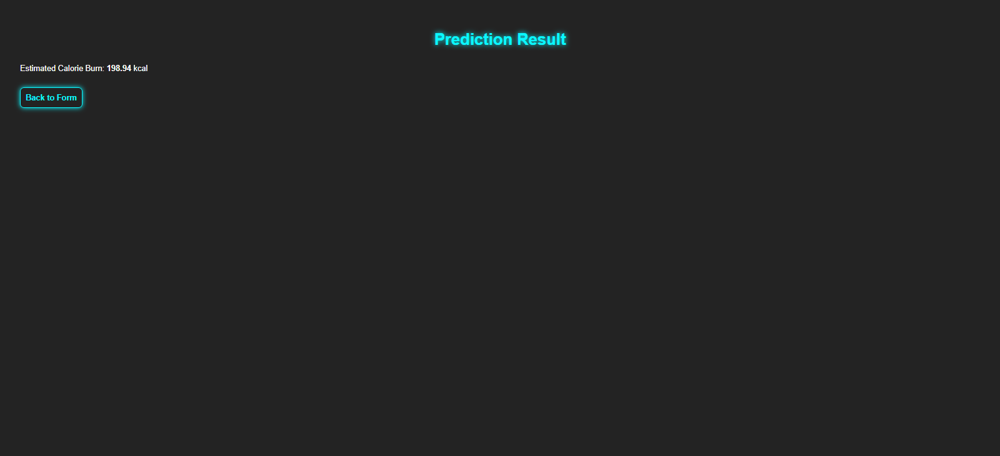

# 🔥 Calorie Expenditure Prediction System (Regression Model)

This is a machine learning–powered web application developed using **Python**, **Flask**, and a tuned **XGBoostRegressor** model to predict **calorie expenditure** during physical activity.

After training and tuning the regression model with **XGBoostRegressor**, the final optimized model is exported using Pickle and served through a backend built with **Flask**.

## 🚀 Features

- Predicts **calorie expenditure (continuous numeric value)** using health and activity indicators.
- Built using a **tuned regression model** (XGBoostRegressor).
- Interactive and clean web UI built using **HTML/CSS** powered frontend via **Flask**.
- Includes multiple **engineered features** to improve prediction accuracy.
- Uses a **pre-trained model** (best_xgbr_model_final.pkl).
- Lightweight, fast, and deployable on any Python-supported machine.

## 🏋️ Input Parameters

The model predicts **calorie expenditure** using the following inputs:

| **Feature**  | **Type / Unit** |
|-------------|----------------|
| Sex         | Male / Female  |
| Age         | Numeric (years) |
| Height      | cm             |
| Weight      | kg             |
| Duration    | minutes        |
| Heart_Rate  | bpm            |
| Body_Temp   | °C             |

---

## ⚙ Engineered Features (used in training)

During model training, the following additional features were created and are required during prediction as well:

- `Duration_Heart = Duration × Heart_Rate`
- `Duration_Temp = Duration × Body_Temp`
- `Age_Duration = Age × Duration`
- `Weight_Duration = Weight × Duration`
- `Height_Duration = Height × Duration`
- `HR_per_Weight = Heart_Rate / Weight`

> These features are **automatically calculated during model training** and are **expected by the model during inference (prediction)**.  

## 🧰 Technologies Used

- **Python**
- **XGBoostRegressor** – Core Machine Learning regression model
- **Scikit‑learn** – Preprocessing and model utilities
- **Pandas / NumPy** – Data preprocessing & feature engineering
- **Flask** – Web application backend
- **Pickle** – Model serialization
- **Jupyter Notebook** – Model training & evaluation
- **HTML / CSS** – Frontend design

## 📁 Files Included

datasets/train.csv
datasets/test.csv

models/final_ml_model_6.ipynb
models/best_xgbr_model_final.pkl

templates/index.html
templates/result.html

static/styles.css

app.py
README.md
requirements.txt
.gitignore

## ⚙️ Installation & Setup

1. Clone the repository:

   ```bash
   git clone https://github.com/Kalana-S/Calorie-Expenditure-Predicting-System.git
   cd Calorie-Expenditure-Predicting-System
   ```

2. Create virtual environment (optional but recommended):

   ```bash
   python -m venv venv
   venv\Scripts\activate   # For Windows
   # OR
   source venv/bin/activate  # For macOS/Linux
   ```

3. Install dependencies:

   ```bash
   pip install -r requirements.txt
   ```

4. Run the Flask app:

   ```bash
   python app.py
   ```

5. Open your browser and go to `http://127.0.0.1:5000`

## 📸 Screenshots

**Homescreen**


**Prediction Result**


## 🤝 Contribution

Contributions, issues, and feature requests are welcome!
Feel free to open a pull request or start a discussion.

## 📜 License

This project is licensed under the **MIT License** – see the `LICENSE` file for details.
